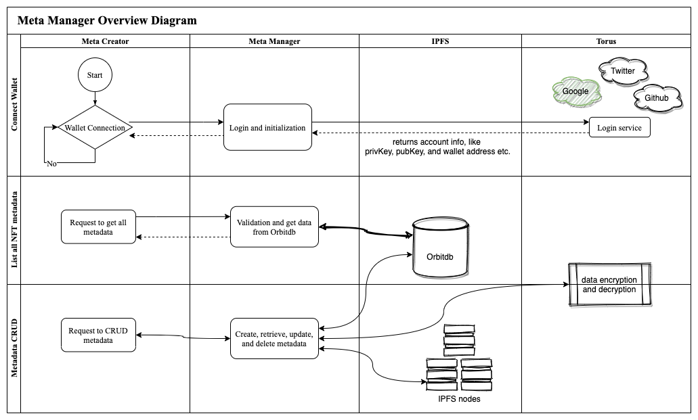

# Decentralised data manager for meta creators (ETH)

This is implemented during the Scaling Ethereum Hackathon hosted by ETHGlobal.

## Tech stack

* Ceramic
    - NFT DIDs - Decentralised Identifier for each NFTs

* Textile - stores the IPFS hashes and abstraction meta data
* IPFS/Filecoin - Fundamentally data storage layer

## Overview diagram

## Screenshots

## To Run Locally

In the project directory, you can run:

### `yarn`

Installs the dependencies.

### `yarn start`

Runs the app in the development mode.\
Open [http://localhost:3000](http://localhost:3000) to view it in the browser.

This project was bootstrapped with [Create React App](https://github.com/facebook/create-react-app).
