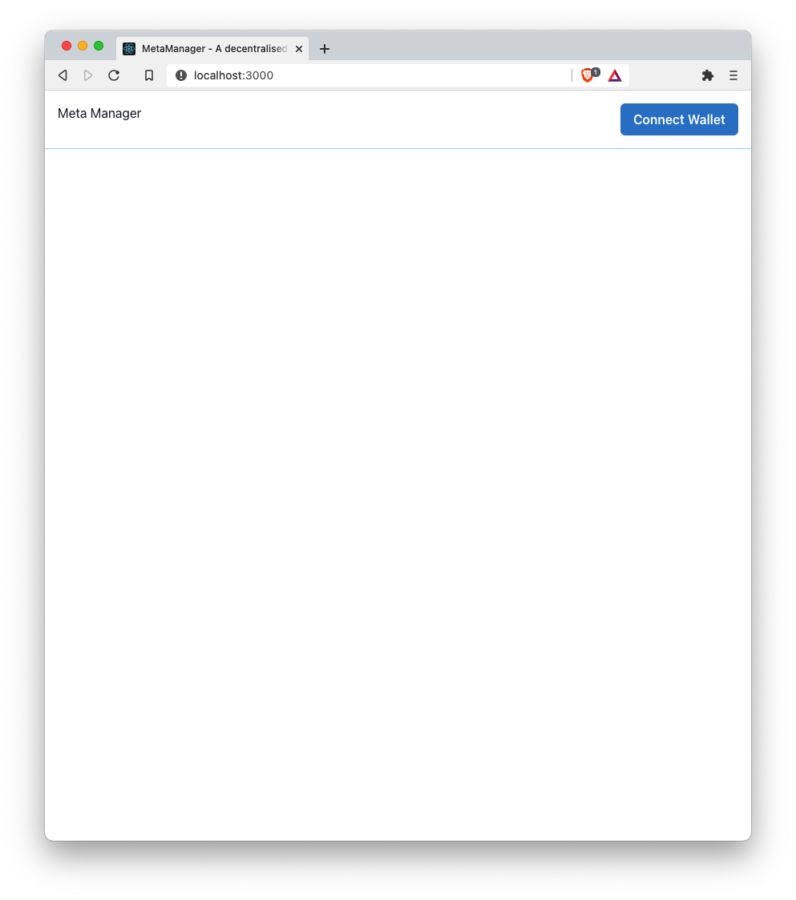
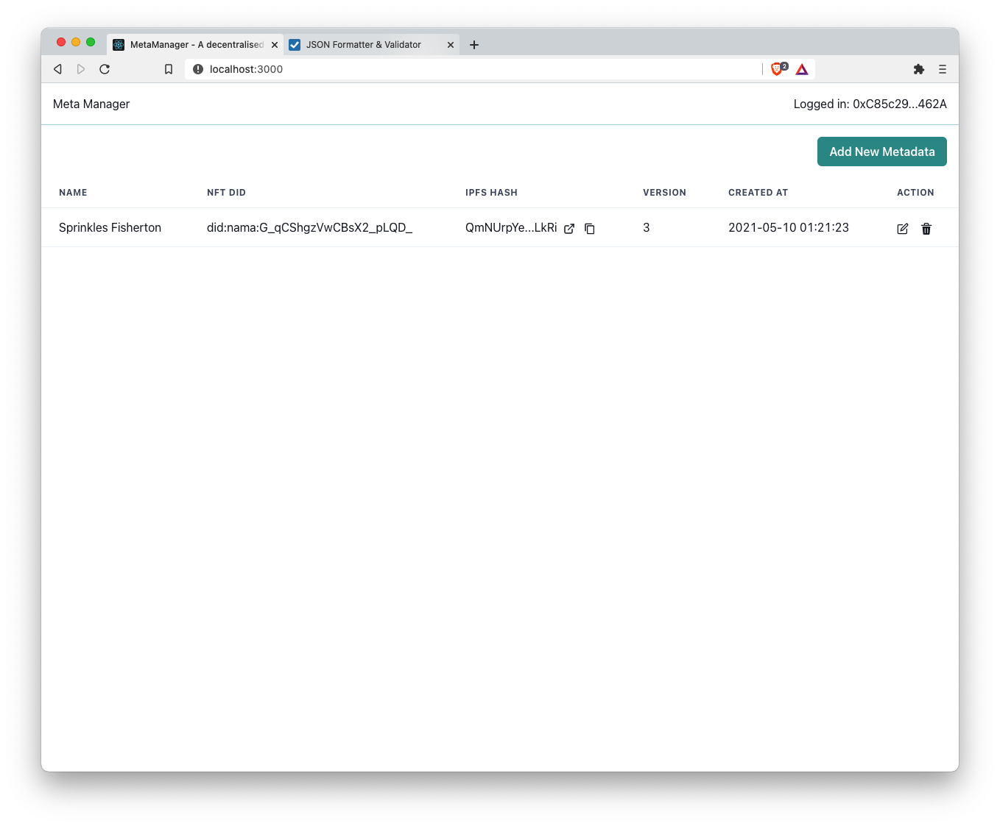
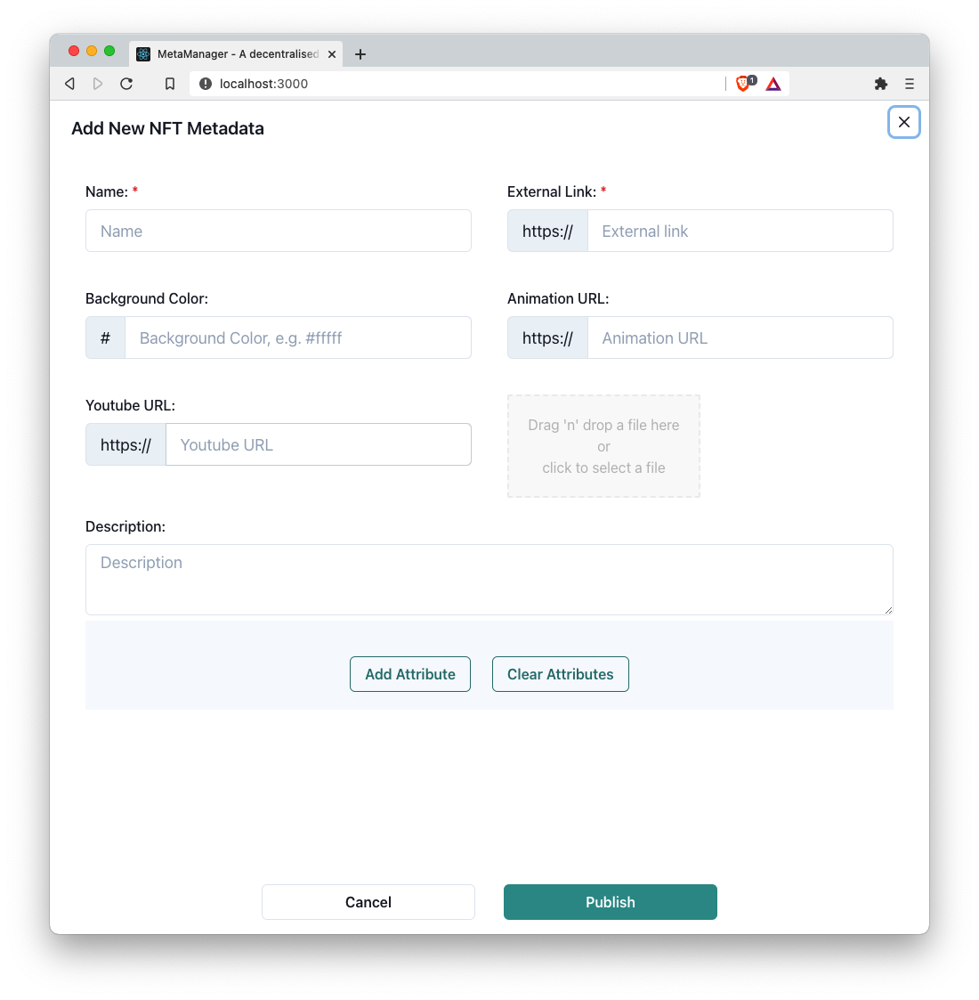

# Decentralised data manager for meta creators

Huge improvements for the previous Scaling Ethereum Hackathon project.

## What changed

* Add mint feature that enables the meta creators to mint their metadata to NFT just in one-click
  
* Replace Orbitdb with Textile's ThreadDB

* Use Textile's Buckets to manage the media files for meta creators all in one place

* Use nft.storage API to persist the to be minted metadata

* Use Ceramic to track the change history of the metadata, and NFT DID resolver

## Tech stack

* Ceramic
  
  - NFT DIDs - Decentralised Identifier for each NFTs

  - Metadata curation history tracking

* Textile 
  
  - Buckets - stores the media files
  
  - ThreadDB - stores the raw metadata

* nft.storage
  
  - Save data to Filecoin
  
* IPFS/Filecoin - Fundamentally data storage layer

## Screenshots

## To Run Locally

In the project directory, you can run:

### `yarn`

Installs the dependencies.

### `yarn start`

Runs the app in the development mode.\
Open [http://localhost:3000](http://localhost:3000) to view it in the browser.

This project was bootstrapped with [Create React App](https://github.com/facebook/create-react-app).
